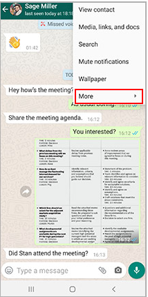
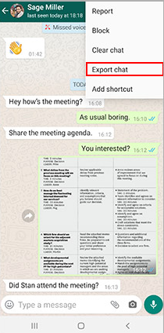
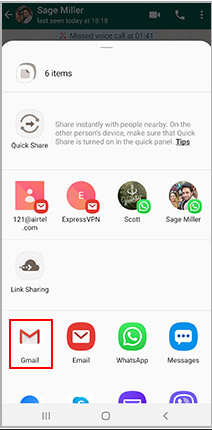

# Avvolto 💬

**Your WhatsApp chat, wrapped.**

Avvolto analyzes your WhatsApp chat exports and turns them into a visual report — think Spotify Wrapped but for your conversations. Detect patterns, personalities, sentiment, and activity trends across any chat.

---

## What does it do?

Upload a `.txt` exported from WhatsApp and get:

- **Personality detection** — who's always quick to reply, the ghost, the novelist, the night owl, and more
- **Activity charts** — when you chat the most, by hour and day of the week
- **Sentiment analysis** — the overall vibe of each person in the chat
- **Top words** — the most meaningful words per person, filtered through NLP
- **Emoji stats** — the most used emojis in the chat
- **Response time** — median response time per participant
- **Message share** — who talks the most

---

## How to export your WhatsApp chat

**Step 1** — Open the chat you want to analyze and tap the three dots menu in the top right.

<div align="center">
  
</div>

**Step 2** — Tap **More** → **Export chat**.

<div align="center">
  
</div>

**Step 3** — Select **Without media** and save or share the `.txt` file.

<div align="center">
  
</div>

---

## Tech stack

**Backend**
- Python 3.12
- Flask — REST API
- pandas — data processing
- spaCy — NLP tokenization and lemmatization (`en_core_web_sm`, `es_core_news_sm`)
- VADER + pysentimiento — sentiment analysis (English and Spanish)
- langdetect — automatic language detection
- Plotly — interactive chart generation

**Frontend**
- HTML / CSS / JavaScript
- Plotly.js — chart rendering
- Space Grotesk + Space Mono — typography

**Deploy**
- Backend: Hugging Face Spaces (Docker)
- Frontend: Vercel


## Run it locally

**1. Clone the repo**

```bash
git clone https://github.com/TU_USUARIO/avvolto.git
cd avvolto
```

**2. Install dependencies**

```bash
pip install -r requirements.txt
python -m spacy download en_core_web_sm
python -m spacy download es_core_news_sm
```

**3. Run the server**

```bash
python app.py
```

**4. Open in browser**

```
http://localhost:7860
```

Then upload any WhatsApp `.txt` export and get your results.

---

## What I built

- All the parsing logic to handle every WhatsApp export format (Android, iOS, 12h/24h, Spanish/English locale, narrow no-break spaces, Meta AI filtering)
- The full NLP pipeline — language detection, stopword filtering, lemmatization, sentiment scoring
- The personality detection system with weighted scoring across 9 archetypes
- The Plotly chart generation pipeline
- The frontend design — dark warm aesthetic with glassmorphism cards

---

## Live demo

[avvolto.vercel.app](https://avvolto.vercel.app)